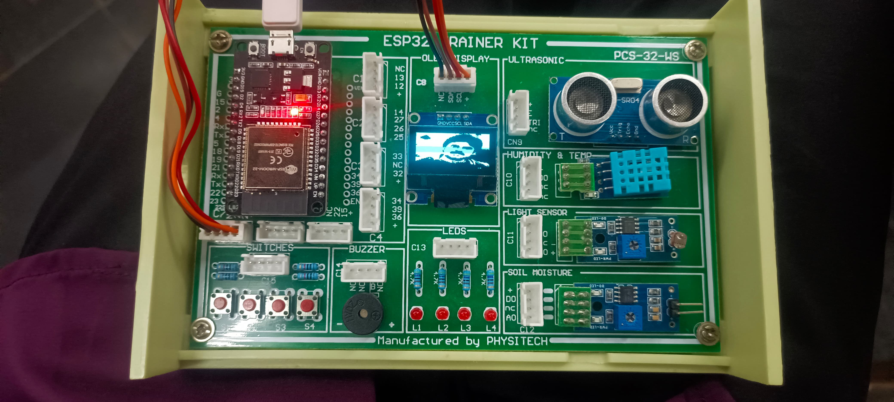

# ESP32-OLED
Displayed OLED images of Pawan Kalyan and Prabhas on an ESP32 trainer kit using embedded display control.
# 🖼️ 128x64 OLED Image Display using Bitmap Array

This project demonstrates how to convert an image into a bitmap array and display it on a 128x64 pixel OLED using Arduino-compatible microcontrollers like ESP8266 or Arduino Uno.

---

## 🚀 Steps to Convert and Display an Image

### ✅ 1. Resize the Image to 128x64 Pixels
- Go to: [https://webupon.com/blog/128x64_pixel-image-converter/](https://webupon.com/blog/128x64_pixel-image-converter/)
- Upload your image.
- Enable **Force Resize** and set resolution to **128x64**.
- Download the resized image.

### ✅ 2. Generate the Bitmap Array
- Visit: [img2cpp tool](https://javl.github.io/image2cpp/)
- Upload your **resized image**.
- Set the following options:
  - **Output format**: `Arduino Code`
  - **Display size**: `128x64`
  - **Color mode**: `Monochrome`
  - **Orientation**: `Horizontal`
  - Enable or disable **Invert** depending on your background
- Click **Generate Code**
- Copy the `const unsigned char` bitmap array

### ✅ 3. Paste the Bitmap in Your Arduino Sketch

```cpp
#include <Wire.h>
#include <Adafruit_GFX.h>
#include <Adafruit_SSD1306.h>

#define SCREEN_WIDTH 128
#define SCREEN_HEIGHT 64
#define OLED_RESET    -1

Adafruit_SSD1306 display(SCREEN_WIDTH, SCREEN_HEIGHT, &Wire, OLED_RESET);

// 16x16 binary image (example: a heart shape)
const uint8_t myBitmap[] PROGMEM = {
 ---->paste Hex code here
};

// Array of all bitmaps for convenience. (Total bytes used to store images in PROGMEM = 1040)

// Array of all bitmaps for convenience. (Total bytes used to store images in PROGMEM = 1040)

// Array of all bitmaps for convenience. (Total bytes used to store images in PROGMEM = 1040)


void setup() {
  Serial.begin(9600);
  if (!display.begin(SSD1306_SWITCHCAPVCC, 0x3C)) {
    Serial.println(F("SSD1306 allocation failed"));
    for (;;);
  }

  display.clearDisplay();

  // Draw bitmap at (x, y), width = 16, height = 16
  display.drawBitmap(0, 0, myBitmap, 128 , 64, WHITE);

  display.display();
}

void loop() {
  // Nothing here
}
---
## 📂 Project Directory
---

Add files via upload/
├── Output/ # Contains output screenshots/images
│ ├── oled_preview1.png
│ └── oled_preview2.png
├── LICENSE # License file
├── PAWAN4LYAN-OLED-ESP32.ino # ESP32 OLED sketch file with image 1
├── PRABHAS-ESP32-OLED.ino # ESP32 OLED sketch file with image 2
└── README.md # Project documentation

---

## 🔧 How It Works

1. Go to [this tool](https://webupon.com/blog/128x64_pixel-image-converter/) to resize your image to **128x64 pixels**.
2. Convert it to monochrome byte array using [img2cpp](https://javl.github.io/image2cpp/).
3. Copy the generated array into the `.ino` file where the image data is expected.
4. Upload the code to your ESP32 using the Arduino IDE or PlatformIO.

---

## 🖼️ OLED Display Output

### Example 1:


### Example 2:

---

## 📝 License

This project is licensed under the MIT License - see the [LICENSE](LICENSE) file for details.
